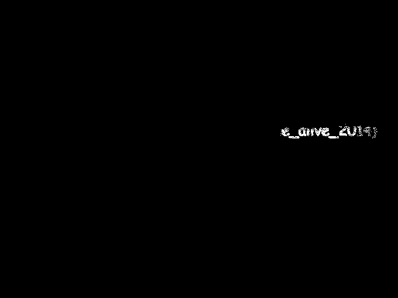
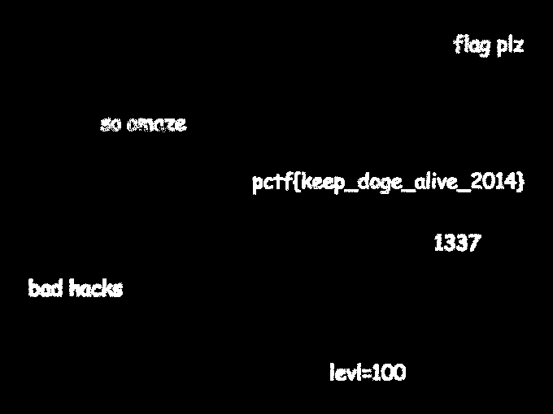
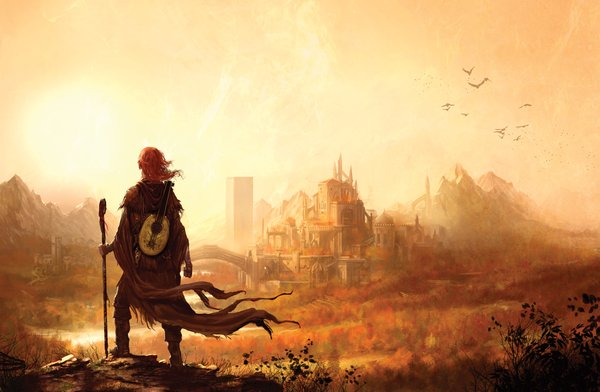

# Steganography Lab

One of the most common steganography tricks is to hide a file inside of an image. The file will open normally as an image but will also hold hidden files inside, commonly zip, text, and even other image files.

The reason this works is because when an image file is read it has starting and ending bytes dictating the size of the image. The image viewer that you use will use the information between these bytes to present an image to you, ignoring anything after the terminating byte.

For example, The terminating byte for a JPEG is FF D9 in hex, so using a hex viewer (xxd is good for linux, or something like HxD for windows) you can find out where the image finishes. These bytes are sometimes hard to find in a sea of numbers though, so looking at the dump of the hex (the text representing the hex bytes) can also help you find hidden .txt or .zip files.

## easy.jpg

Let's apply this with a pretty straightforward example. See if you can find FF D9 to where this file ends and a new one begins. Use the " strings [Filename.extension] " command to confirm your suspicions aobut there being something fishy in there. But how to extract it... There is a tool on Linux for this called dd , but it only takes decimal values.

## doge_stege.png

This picture is from a 2014 CTF challenge.

We start with our original image, a simple doge meme:


Auditing it with `pngcheck -v doge_stege.png` returns no errors. 

So let's check for anything hidden in the data itself. `strings doge_stege.png` doesn't return anything meaningful. Using `foremost doge_stege.png` doesn't show any hidden files. At 202KB, that'd be unlikely anyway.

Lets use file to see what this thing is made of:

```bash
$ file doge_stege.png
doge_stege.png: PNG image data, 680 x 510, 8-bit colormap, non-interlaced
```

Whelp. Nothing too exciting. We do learn that the image only contains 256 colors, awfully low for a png.

8-bit colormaps are common places to hide text in steganography challenges because altering the color of text by just one RGB value will allow the text to be invisible to the naked eye, but if someone knows the value of the RBG text they're looking for, they can highlight the text and retrieve it from the colormap.

After some lazy searching, we find a tool to change the palette (or colormap) of a PNG using Python [on Stack Overflow](http://stackoverflow.com/a/1214765/96656).

Let's modify this a little bit so that instead of changing the 3rd palette to cyan like the requester wanted, it changes everything to white except for the desired color, which will be black.

```python
#!/usr/bin/env python

import sys
import struct
from zlib import crc32
import os

# PNG file format signature
pngsig = '\x89PNG\r\n\x1a\n'

def swap_palette(filename, n):
    # open in read+write mode
    with open(filename, 'r+b') as f:
        f.seek(0)
        # verify that we have a PNG file
        if f.read(len(pngsig)) != pngsig:
            raise RuntimeError('not a png file!')

        while True:
            chunkstr = f.read(8)
            if len(chunkstr) != 8:
                # end of file
                break

            # decode the chunk header
            length, chtype = struct.unpack('>L4s', chunkstr)
            # we only care about palette chunks
            if chtype == 'PLTE':
                curpos = f.tell()
                paldata = f.read(length)

                # CHANGED THIS
		        # replace palette entry n with white, the rest with black
                paldata = ("\x00\x00\x00" * n) + "\xff\xff\xff" + ("\x00\x00\x00" * (256 - n - 1))

                # go back and write the modified palette in-place
                #END CHANGES
                f.seek(curpos)
                f.write(paldata)
                f.write(struct.pack('>L', crc32(chtype+paldata)&0xffffffff))
            else:
                # skip over non-palette chunks
                f.seek(length+4, os.SEEK_CUR)

if __name__ == '__main__':
    import shutil
    shutil.copyfile(sys.argv[1], sys.argv[2])
    swap_palette(sys.argv[2], int(sys.argv[3]))
```

Now we want to do this for all 256 colors, since only one of these is going to have our secret text. Luckily, some quick bash scripting gets the job done:

```bash
$ for i in {0..255}; do ./change_palette.py doge_stege.png "single-color-${i}.png" "${i}"; done
```

Going through these images it seems multiple pictures contains fragments of invisible text. `single-color-127.png` is the first in which this invisible text appears:



Unfortunately for us, this means the message is composed of multiple entries in the colormap. We could do the tedious job of looking through all 127 of these fragments and linking them together, but why do that when you could code! Instead, let's add a line to our python script that will highlight a range of colormap entries starting from `127` onwards:

```python
		        # replace palette entry 127 to 127 + n with white, the rest with black
                paldata = ("\x00\x00\x00" * 127) + ("\xff\xff\xff"*n) + ("\x00\x00\x00" * (256 - (127 + n)))
```
And modify our bash script accordingly:

```bash
$ for i in {0..128}; do ./change_palette.py doge_stege.png "range-color-127+${i}.png" "${i}"; done
```

In e.g. `range-color-127+54.png`, the full message becomes readable:



Time to Party
=============

Let's see if you can get these challenges on your own:



 